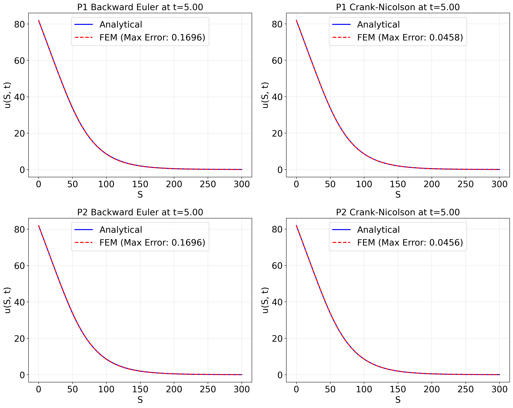

# Finite element solver for European Put Black-Scholes Equation

Numerical approximation of PDEs MATH-451 project, Spring 2025, EPFL

---

## Table of Contents

1. [Motivation](#motivation)
2. [Installation](#installation)
3. [Code structure](#code-structure)
4. [Report](#report)
5. [License](#license)
6. [Authors](#authors)

---

## Motivation
This project aims to numerically solve the Black-Scholes PDE for European put options using finite element methods. By reformulating the equation in its variational form and applying time-stepping schemes like backward Euler and Crank-Nicolson, the project investigates stability, accuracy, and convergence. Both a constructed solution and the real model are used to validate the method. The work combines theory with implementation to explore a key problem in computational finance.

---

## Installation
Ensure you have Python 3.10+ and a virtual environment activated. Next clone the repository onto your local machine:

```bash
>>> git clone https://github.com/MattiaBarbiere/FEM_for_Black_Scholes.git
```
To install the requirements, move into the `code/` folder and run
```bash
>>> pip install -r requirements.txt
```

---

## Code structure
All the code is available in the `code/` folder.

- **fem_solver.py**: Code for the 1D finite element solver.

- **black_scholes_pde.py**: Classes for analytical soluitons of the Black-Scholes Equation.

- **main.py**: Main file for solving and plotting the PDEs.

- **quad.py**: Class for the quadrature points needed for numerical integration.

- **tests.py**: Simple tests to check correct implementation of the P1 and P2 basis functions.

For more details, see [code/README.md](./code/README.md) and docstrings in each file.

---

## Report

For the full report of the project, including some theoretical background and experimental analysis, visit [Final_report_Mattia_Barbiere](./Final_report_Mattia_Barbiere.pdf).

### Result
For a visual example, below you find the analytical solution (blue) versus interpolated finite element solution (dashed red) for various methods at time $t = 5$. The PDE was solved with $h = 0.5$ and
$\Delta t = 0.5$ using the Gauss-Legendre quadrature with 10 points. First and second row correspond to
P1 and P2 finite elements respectively. First and second column correspond to backwards Euler and
Crank-Nicolson’s method respectively. In legend the maximum errors is presented for all four plots.

---

## License

This project is licensed under the **MIT License**. See the [LICENSE](LICENSE) file for more details.

---

## Authors

Developed by **Mattia Barbiere** as part of the Numerical approximation of PDEs MATH-451 course during the spring 2025 semester at EPFL.  
GitHub: [@MattiaBarbiere](https://github.com/MattiaBarbiere)

---